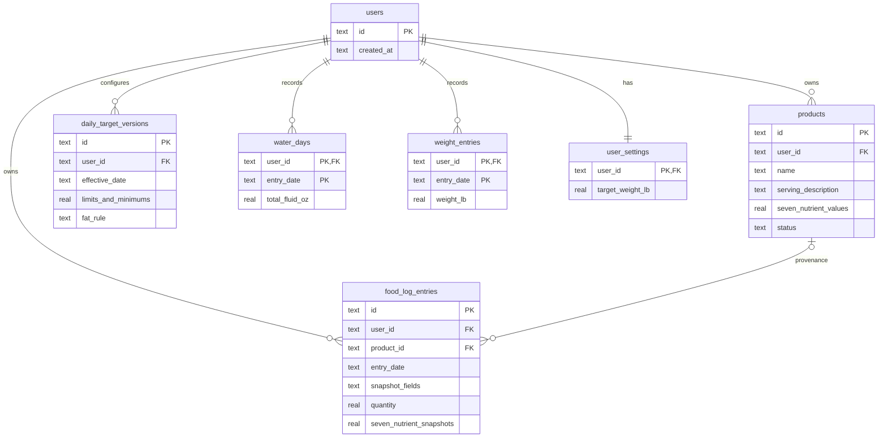

<!-- BEGIN:nextjs-agent-rules -->

# This is NOT the Next.js you know

This version has breaking changes — APIs, conventions, and file structure may all differ from your training data. Read the relevant guide in `node_modules/next/dist/docs/` (resolved from this file's directory; in monorepos the `next` package may not be visible from the repo root) before writing any code. Heed deprecation notices.

This block is written and re-added by `next dev` — verify at `node_modules/next/dist/server/lib/generate-agent-files.js`. Removing it from a diff only re-creates the uncommitted change; committing it with your work keeps the tree clean.

<!-- END:nextjs-agent-rules -->

# Daily Intake

Daily Intake is a local, single-user nutrition ledger. It helps one person
record reusable serving-based foods, dated food snapshots, hydration, daily
comparison targets, and weight history without an account or cloud service.
Manual entry is the MVP. Future barcode, label/OCR, and image-analysis inputs
must populate the same source-neutral product draft seam without changing the
food-log snapshot model.

## Project References

- `PRODUCT.md` is the product brief, vocabulary, constraints, principles, and
  accessibility requirements. Treat it as the product source of truth.
- `DESIGN.md` is the visual and interaction source of truth used by the
  `/impeccable` skill. Preserve its Night Field Ledger direction, tokens,
  navigation topology, responsive rules, and accessibility grammar.
- `README.md` documents local setup, database location, migration behavior, and
  verification commands.
- `docs/research/daily-fat-target.md` records the research basis for the
  derived fat limit.

## Tech Stack

- Next.js `16.3.0` App Router with Node.js route handlers.
- React `19.2.8`, TypeScript 5, strict mode, and the `@/*` -> `src/*` alias.
- SQLite through `better-sqlite3`; no ORM. Database access is server-side.
- CSS Modules plus global CSS; Geist is loaded through `next/font`.
- Vitest `4.1.10` for unit, repository, and API tests.
- ESLint 9 with `eslint-config-next`.
- Node.js 22 or newer, pnpm 11 (`pnpm@11.10.0`).

Useful commands:

```text
pnpm dev       # local development server
pnpm test      # Vitest run
pnpm lint      # ESLint
pnpm build     # production build
pnpm start     # production server
```

## Quality Check Gates

Do not treat a feature or fix as complete until the applicable gates pass:

1. **Scope gate:** Read `PRODUCT.md` and `DESIGN.md` for product, interaction,
   accessibility, and visual constraints. Confirm the change does not add
   out-of-scope MVP behavior or bypass the service/domain boundaries.
2. **Automated gate:** Run `pnpm test`, `pnpm lint`, and `pnpm build`. All three
   must pass before declaring the work complete.
3. **Behavior gate:** Add or update domain, repository, and API tests for
   changed behavior. Cover validation failures, boundary conditions, malformed
   requests, historical snapshot/target preservation, and migration safety when
   relevant.
4. **UI gate:** For UI changes, manually verify desktop and narrow-screen
   layouts. Check there is no ordinary-content horizontal overflow, keyboard
   focus remains visible, form labels and errors are actionable, loading and
   save states are announced, and reduced-motion behavior remains respected.
5. **Review gate:** Inspect `git diff --check`, `git status`, and the final diff.
   Do not include generated build output, local database changes, secrets, or
   unrelated worktree changes. Report any skipped gate explicitly.

If a gate cannot be run, do not silently claim completion; document the blocker
and the remaining verification work.

## Architecture

The application uses a thin App Router presentation layer over a testable
domain/service/repository stack:

```text
Browser UI
  -> App Router pages and client components
  -> /api/v1/* Node route handlers
  -> IntakeService
  -> domain validation, calculations, and business rules
  -> repositories
  -> better-sqlite3 / data/calories.db
```

- `src/app/` contains route entry points, the shared `AppShell`, client
  workflows, and CSS Modules.
- `src/lib/domain.ts` owns domain types, normalization, date rules, nutrition
  scaling, aggregation, target status, water conversion, and validation errors.
- `src/lib/intake-service.ts` coordinates repositories and enforces application
  behavior such as product-to-snapshot conversion and effective target lookup.
- `src/lib/database.ts` initializes the schema, bootstraps the one local user,
  performs legacy migration, and wires the singleton repositories/service.
- `src/lib/*-repository.ts` files isolate SQLite persistence for products, food
  logs, targets, water, weight, and settings.
- `src/lib/product-draft.ts` defines the manual provider and source-neutral seam
  for future product input providers.
- API routes use `src/lib/api.ts` for malformed JSON and consistent JSON error
  responses. The UI currently calls `/api/v1/*`.

Database path resolution is `DAILY_INTAKE_DB_PATH`, then legacy
`CALORIE_DB_PATH`, then `data/calories.db`. API routes that touch SQLite must
remain on the Node runtime.

## Application Routes And Components

UI route boundaries:

- `/` -> `src/app/page.tsx` and `src/app/DailyLog.tsx`: today or past-date
  ledger, nutrient totals/status, water controls, and food snapshot editing.
- `/foods` -> `src/app/foods/page.tsx` and
  `src/app/foods/FoodDatabaseClient.tsx`: product search, create/edit/retire,
  quantity/review, and explicit food-log confirmation.
- `/settings` -> settings record chooser.
- `/settings/targets` -> `TargetsClient.tsx` and `TargetForm.tsx`: first target
  setup and effective-dated target versions.
- `/settings/weight` -> `WeightClient.tsx`: dated pounds, same-date replacement,
  SVG trend chart, and optional target line.
- `/prototype/food-entry` is a redirect-only legacy path; do not build new
  behavior there.

`src/app/AppShell.tsx` owns desktop sidebar and mobile four-item navigation.
Keep the Daily Log, Food Database, Targets, and Weight topology intact.

Primary API routes:

```text
/api/v1/day
/api/v1/products and /api/v1/products/[id]
/api/v1/food-log and /api/v1/food-log/[id]
/api/v1/targets
/api/v1/water
/api/v1/weights
/api/v1/settings
```

Non-versioned `/api/*` paths remain compatibility wrappers. Avoid adding new
business logic to those wrappers; put behavior in the service and versioned
routes.

## Domain Invariants

- Dates are local calendar dates in `YYYY-MM-DD`. Food, water, targets, and
  weights reject future dates; today is the default.
- Food products are serving-based only. Serving descriptions are required free
  text and are not parsed or unit-converted.
- Nutrition values accept decimals and must be finite and non-negative.
- Serving quantities must be finite, positive decimals. Logged totals are the
  saved per-serving snapshot multiplied by quantity.
- Food log entries copy title, serving description, quantity, and all seven
  nutrient values at confirmation. Product edits or retirement never rewrite
  historical snapshots; repeated additions create independent rows.
- Calories, carbohydrates, fiber, sugar, sodium, and fat are maximums. Protein
  and water are minimums. Fat is derived exactly as
  `calorieMaximumCal * 0.30 / 9`; round only for display.
- Target versions are effective-dated. Resolve the latest version whose
  `effectiveDate <= selectedDate`; never mutate a historical version.
- Water is stored as fluid ounces. One glass is `8 fl oz`; one bottle is
  `16 fl oz`; displayed glasses are `totalFluidOz / 8`.
- Weight stores one positive pounds value per date. Same-date writes replace.
- Target weight is one optional current setting and is not required for setup.
- Status language describes configured limits/minimums only. Do not use medical,
  safety, ideal, prescribed, or judgmental claims.

## Database Diagram

The schema is initialized in `src/lib/database.ts`. Current tables and key
relationships:



`food_log_entries.product_id` uses `ON DELETE SET NULL`. Snapshot columns are
the historical record and must be readable without a live product. The legacy
`calorie_entries` table is retained for migration compatibility, and
`schema_migrations` records the legacy migration version.

## Migration Rules

Do not silently discard the existing calorie-only database. Migration version 1
copies each `calorie_entries` row into an editable food snapshot, preserving its
date, name, and calories. Unknown nutrients become zero; do not invent macro
values or create a misleading reusable product. The current migration system is
minimal schema initialization plus this compatibility migration, not a mature
general migration framework.

## Current Status

The planned MVP is mostly implemented and usable:

- Local single-user persistence, seven-nutrient products, product lifecycle,
  independent snapshots, food-log edit/delete, separate water, target
  versioning, fat calculation, weight history, optional target line, manual
  product draft seam, legacy migration, responsive shell, and accessibility
  feedback are present.
- First-run targets are shown inline on the Daily Log rather than through a
  dedicated setup route.
- The target strip is a six-cell summary; fat status is shown in the nutrient
  matrix instead.
- Direct catalog product creation saves and returns to the catalog; creation
  transitions directly to review only when a selected-date return context exists.
- API compatibility wrappers and legacy calorie modules remain intentionally,
  so remove or consolidate them only with an explicit migration decision.
- UI/component/browser tests are not present. Field-level validation, malformed
  request coverage, and mobile/accessibility browser verification remain limited.

Before treating a feature as complete, run `pnpm test`, `pnpm lint`, and
`pnpm build`; manually check desktop and narrow-screen behavior when UI changes
are involved. Existing automated tests cover domain calculations, repositories,
legacy migration, and basic API flows, but not the full browser experience.

## Working Guidance

- Keep domain rules in `src/lib/domain.ts` or `IntakeService`, not duplicated in
  UI components or route handlers.
- Keep food, water, weight, targets, and settings as separate persistence
  concerns.
- Preserve snapshot and effective-date history when changing products or targets.
- Use `cal`, `g`, `mg`, `fl oz`, and `lb` labels; do not render `kcal`.
- Keep loading, success, and error states explicit with appropriate status or
  alert semantics. Preserve visible keyboard focus and reduced-motion behavior.
- Do not add authentication, cloud sync, future-source UI, favorites, barcode,
  OCR, AI image analysis, recipes, exercise, reminders, or recommendations to
  the MVP.
