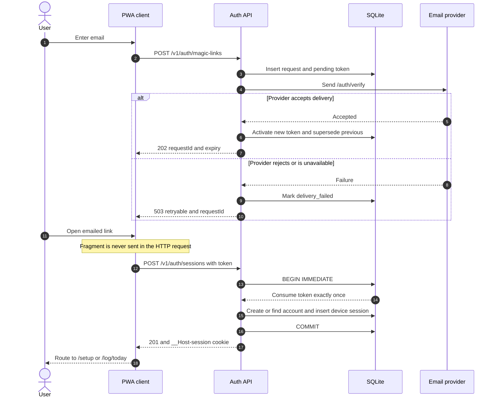
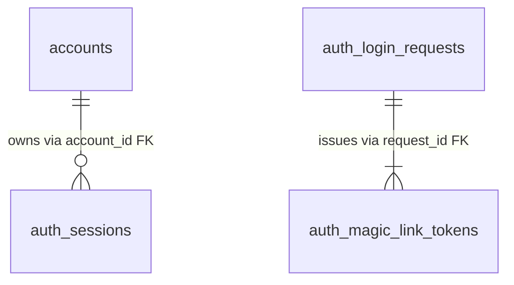
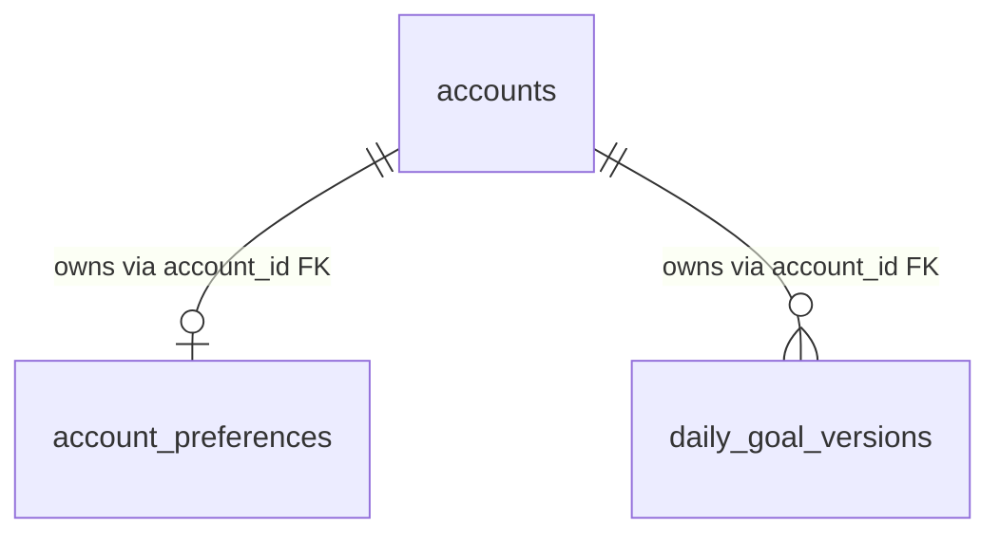

# Calorie Tracker — Technical Design Document

## 1. Status and Purpose

This technical design document is derived from the confirmed product requirements. It identifies required system behavior, domain invariants, and unresolved technical decisions. The authentication API, immediate account-onboarding API, their SQLite persistence models, client framework, Safari-installed PWA delivery, package manager, backend language, and backend framework are approved; the remaining logging-domain architecture is not yet selected.

The client will be a Safari-installed Progressive Web App built with Ionic React and TypeScript. It is explicitly iOS-first, with iPhone as its primary use environment. The workspace will use pnpm. The API will use Node.js, Express 5, and TypeScript. Capacitor and App Store packaging are not part of version one.

## 2. Technical Scope

The system will eventually require these major capabilities:

- Passwordless email authentication and mandatory email ownership verification
- Strict per-account data isolation
- Daily food, plate, nutrition, goal, and water persistence
- Food catalog search and item retrieval
- Barcode capture and lookup
- Nutrition-label image capture and value extraction
- Attached image storage and lifecycle management
- Offline local persistence with later synchronization
- Derived daily nutrition and water aggregates
- Historical goal versioning by effective date
- Multi-device synchronization and conflict preservation
- US and metric display conversion

The current implementation phase is limited to authentication: email entry, delivery failure and resend, check-email guidance, magic-link exchange states, persistent device sessions, local sign-out, and the first-time setup gate. Section 6 also approves the immediate account-onboarding API and SQLite model, but this client mock does not implement setup submission. Food logging, scanning, water, images, and synchronization are not part of the current mock.

### 2.1 Confirmed implementation stack

- **Workspace and package manager:** pnpm workspace. Client and server commands run from the repository root.
- **Client:** Ionic 8 with React and TypeScript, installed from Safari as a version-one PWA. Ionic is configured with iOS component behavior and a dark iPhone-first visual language. The production build emits a web app manifest, iPhone home-screen icon, standalone display metadata, and an automatically updated service worker.
- **API:** Node.js with Express 5 and TypeScript. The API and PWA use the approved same-origin `/v1` boundary.
- **Authentication and onboarding data:** SQLite 3.37 or newer using the approved section 6 models in production.
- **Authentication mock:** the review server uses process-local memory and a development-only magic-link helper. It demonstrates the contract but is not production persistence or a transactional-email substitute.
- **Test tooling for authentication:** Vitest and Supertest for TDD-derived API integration scenarios; TypeScript and production PWA builds are workspace quality gates.

Hosting, deployment, the supported Node.js LTS baseline, supported iPhone/iOS versions, transactional email, and production observability are not selected. No food database, image-processing provider, or object-storage provider is selected. Whether SQLite is also the primary database for the remaining logging domain is still pending.

## 3. Conceptual Domain Model

The names below are conceptual and do not prescribe database tables or API resources.

### 3.1 Account

Owns a verified email identity, unit preference, sessions, goals, saved items, logs, and images. All user-owned records must be isolated by account.

### 3.2 Goal version

Contains an effective date and goal values for calories, water, protein, carbohydrates, fat, fiber, sugar, and sodium. Historical goal resolution selects the version active on the viewed date.

### 3.3 Food entry

Represents one consumed food. Expected conceptual fields include:

- Owner
- Calendar date and display time
- Source type: catalog, barcode, nutrition label, favorite, or reusable plate component
- Lifecycle state: pending, successful, retryable error, or terminal error
- Product name
- Measurement and quantity
- Calories and primary nutrient values
- Availability state for each nutrient
- Optional additional nutrition facts
- Optional attached scan image
- Optional parent plate

### 3.4 Plate entry

Represents a named, same-day collection of successful food entries. It owns one fixed plate time and derived combined nutrition. It is text-only and may itself be saved as a reusable template.

### 3.5 Water entry

Represents one plain-water event with owner, calendar date, display time, and normalized volume.

### 3.6 Saved item

Represents a reusable snapshot of either a food or a complete plate. Removing a saved item must not mutate previously logged occurrences.

### 3.7 Scan attempt

Represents the lifecycle of a barcode or label capture, including its image, processing state, error classification, and resulting food entry when successful. Whether this is a separate persisted object or part of a food entry remains a design decision.

## 4. Core Domain Invariants

- Every user-owned record belongs to exactly one account.
- Data from one account must never be readable or mutable by another account.
- A food or water record belongs to one calendar date and cannot be moved to another date.
- Entries for today use current local time.
- Retroactive entries use one minute after the newest existing time on that date, or 12:00 PM when none exists.
- Historical calendar dates remain stable across later timezone changes.
- Only successful same-day food entries can become plate components.
- A food entry cannot simultaneously exist as a standalone card and a plate component.
- A plate's time is copied from the latest selected component at creation and does not derive from later component changes.
- A plate with one component remains valid; a plate with zero components is deleted.
- Plate nutrition is derived from its current components.
- Deleting a logged plate deletes its contained component records.
- Failed records contribute nothing to aggregates.
- A missing nutrient is unknown, not zero.
- Editing one logged food must not mutate catalog data, saved items, or other log occurrences.
- Attached scan images cannot be independently removed from successful entries.

## 5. Authentication Flow Requirements

1. The client accepts an email address.
2. The system validates its basic form and requests a passwordless sign-in email.
3. The user must open the emailed link to establish a verified session.
4. Invalid or failed email delivery returns a user-readable error and supports resend.
5. Successful resend returns a short confirmation.
6. A verified session persists on the device until local sign-out.
7. The same account may maintain simultaneous sessions on multiple phones.

Account deletion, email-address changes or recovery, and remote revocation of all sessions are not required in version one. No self-service recovery API or UI will be included. Section 6 defines the approved link lifetime, replay protection, session persistence, and token-rotation policies.

## 6. Authentication API and SQLite Schema

This section defines the approved version-one authentication boundary. It uses the confirmed Ionic React client and Node.js/Express API, JSON request and response bodies, SQLite 3.37 or newer, and application-generated UUIDv7 identifiers.

### 6.1 API conventions

- API routes use the `/v1` prefix.
- Email-send operations require a UUID `Idempotency-Key` header so a lost mobile response does not cause duplicate email.
- Magic links expire after 15 minutes and are single-use. A successful resend supersedes the prior active link; a failed resend leaves the prior link usable.
- The email link opens the client route `/auth/verify#token=<raw-token>`. Keeping the token in the fragment prevents it from entering normal HTTP logs and prevents ordinary HTTP-only link scanners from redeeming it.
- The client removes the fragment with `history.replaceState` and exchanges the token immediately.
- Authenticated requests use a persistent, host-only `__Host-session` cookie with `HttpOnly`, `Secure`, `SameSite=Lax`, and `Path=/`. The API reissues it during use because browsers may cap cookie lifetime. Raw session tokens are never returned in JSON.
- Error responses contain a stable machine code, a user-readable message, and a `retryable` boolean.

### 6.2 Endpoints

| Method | Route | Authentication | Input | Success | Main errors and behavior |
| --- | --- | --- | --- | --- | --- |
| `POST` | `/v1/auth/magic-links` | Public | `email` plus `Idempotency-Key` | `202` with `requestId`, `expiresAt`, and `resendAvailableAt` after the email provider accepts the delivery | `422` malformed email; `429` throttled; `503` delivery unavailable. A delivery failure still returns `requestId` so the client can offer Resend. |
| `POST` | `/v1/auth/magic-links/{requestId}/resend` | Public | Empty JSON body plus `Idempotency-Key` | `202` with confirmation, `expiresAt`, and `resendAvailableAt` | `404` unknown request; `410` expired request; `429` cooldown or limit; `503` delivery unavailable. |
| `POST` | `/v1/auth/sessions` | Public with magic-link token | `token` | `201`, a new session cookie, `account`, `setupComplete`, and `next` | `400` invalid token; `409` already consumed; `410` expired or superseded; `429` throttled. Token consumption, account creation or lookup, and session creation are atomic. |
| `GET` | `/v1/auth/session` | Session cookie | None | `200` with `account`, `setupComplete`, and `next` | `401` when the cookie is missing or the session was revoked. It also reissues the persistent cookie and updates `last_seen_at` at most once per day. |
| `DELETE` | `/v1/auth/session` | Session cookie when present | None | Idempotent `204`; revokes only the presented session and clears its cookie | It never revokes another phone's session. A missing or already-revoked session still produces the idempotent result. |

`setupComplete` is false while `accounts.onboarding_completed_at` is null. In that state, `next` is `/setup`; otherwise it is `/log/today`.

### 6.3 Sign-in sequence



### 6.4 SQLite schema

All timestamps are UTC Unix seconds stored as `INTEGER`. Token hashes and rate-limit keys are 32-byte `BLOB` values. Raw magic-link and session tokens are 32 random bytes encoded as unpadded base64url outside the database; only their SHA-256 digests are stored.

#### `accounts`

| Column | Type and constraint | Purpose |
| --- | --- | --- |
| `id` | `TEXT PRIMARY KEY` | UUIDv7 account identifier. |
| `email` | `TEXT NOT NULL` | Trimmed display and delivery address. |
| `email_key` | `TEXT NOT NULL UNIQUE` | Application-generated Unicode-normalized, lowercased lookup key. This prevents a second account for the same normalized email and must not rely on SQLite's ASCII-limited default `NOCASE` behavior. |
| `email_verified_at` | `INTEGER NOT NULL` | Time at which the first magic link was exchanged. An account is never created before this event. |
| `onboarding_completed_at` | `INTEGER NULL` | Remains null until unit preferences and the first goal version are saved together. Authentication uses it only to return the setup gate. |
| `created_at`, `updated_at` | `INTEGER NOT NULL` | Record lifecycle timestamps. |

Justification: this table is the single verified identity record and the ownership root for all private user data. It stores no name, demographic, or health-profile fields.

#### `auth_login_requests`

| Column | Type and constraint | Purpose |
| --- | --- | --- |
| `id` | `TEXT PRIMARY KEY` | Public, unguessable request identifier used by Resend. |
| `email`, `email_key` | `TEXT NOT NULL` | Delivery value and canonical lookup value captured before an account necessarily exists. |
| `create_key` | `TEXT NOT NULL UNIQUE` | Idempotency key for the initial send request. |
| `created_at`, `expires_at` | `INTEGER NOT NULL` | Request lifecycle; the request expires after 30 minutes. |
| `last_delivery_at` | `INTEGER NULL` | Enforces the resend cooldown. |

Justification: one row represents one "email me a link" UI attempt. It groups the initial email and every resend under one stable request ID without creating an unverified account.

#### `auth_magic_link_tokens`

| Column | Type and constraint | Purpose |
| --- | --- | --- |
| `id` | `TEXT PRIMARY KEY` | Identifier for one initial-send or resend token. |
| `request_id` | `TEXT NOT NULL` foreign key | References `auth_login_requests.id` with cascade delete. |
| `token_hash` | `BLOB NOT NULL UNIQUE` | SHA-256 digest of the one-time bearer token. |
| `delivery_key` | `TEXT NOT NULL UNIQUE` | Idempotency key for this specific delivery attempt. |
| `status` | constrained `TEXT` | One of `pending_delivery`, `active`, `consumed`, `superseded`, or `delivery_failed`. |
| `provider_message_id`, `failure_code` | nullable `TEXT` | Provider correlation and safe error classification. |
| `created_at`, `expires_at`, `delivered_at`, `consumed_at`, `superseded_at` | `INTEGER`, with lifecycle values nullable where inapplicable | Supports expiry, replay rejection, delivery state, and newest-link-wins behavior. |

Justification: every initial email or resend contains a different secret and can have a different delivery result. Separate rows let one token be failed, consumed, or superseded without losing the history or invalidating a working prior link when a resend fails.

#### `auth_sessions`

| Column | Type and constraint | Purpose |
| --- | --- | --- |
| `id` | `TEXT PRIMARY KEY` | Internal identifier for one phone or browser session. |
| `account_id` | `TEXT NOT NULL` foreign key | References `accounts.id` with cascade delete. It is deliberately not unique because one account may be signed in on several phones. |
| `token_hash` | `BLOB NOT NULL UNIQUE` | Digest of the current opaque cookie token. |
| `previous_token_hash` | `BLOB NULL UNIQUE` | Prior digest accepted only during rotation grace. |
| `previous_token_valid_until` | `INTEGER NULL` | Two-minute grace deadline for concurrent requests after rotation. |
| `created_at`, `last_seen_at`, `rotated_at` | `INTEGER NOT NULL` | Session activity and rotation timestamps. |
| `revoked_at`, `revoke_reason` | nullable `INTEGER` and `TEXT` | Records local sign-out or explicit administrative revocation. |

Justification: one row per signed-in phone is what allows simultaneous phone sessions and current-phone-only sign-out. There is intentionally no server-side `expires_at`; the approved policy keeps the row valid until explicit revocation. Browsers and operating systems may still cap cookie lifetime or clear local site data.

#### `auth_rate_limit_buckets`

| Column | Type and constraint | Purpose |
| --- | --- | --- |
| `scope`, `key_hash`, `window_started_at` | composite primary key | Identifies one action, privacy-preserving email or IP key, and rate window. |
| `attempts` | `INTEGER NOT NULL` | Atomic attempt count. |
| `expires_at` | `INTEGER NOT NULL` | Cleanup time for the short-lived bucket. |

Justification: this table prevents email bombing, transactional-email cost abuse, and repeated token guesses. For example, a sixth send to one email within 15 minutes returns `429`. It has no foreign key because throttling runs before authentication and before a first-time account exists. Keeping the counter in SQLite makes increments atomic and preserves limits across an API restart; a future multi-node deployment should use a shared edge or distributed limiter.

### 6.5 Relationships and invariants



- One `accounts` row owns zero or more `auth_sessions` rows. Multiple sessions are required by the multi-phone behavior; `accounts.email_key` uniqueness prevents duplicate accounts, while `auth_sessions.account_id` remains non-unique deliberately.
- One `auth_login_requests` row owns one or more `auth_magic_link_tokens` rows through `request_id`.
- There is deliberately no foreign key from a login request or magic-link token to an account. A first-time user has no account yet. Exchange follows token to request to `email_key`, then atomically creates or finds the account and inserts its session.
- `auth_rate_limit_buckets` is a standalone security structure rather than user-owned data, so it has no foreign key to any auth table.
- Magic-link exchange uses `BEGIN IMMEDIATE`. It must change exactly one active, unexpired token to `consumed`, create or find the account by `email_key`, and insert the session in one transaction.
- Session secrets rotate every 30 active days. The previous digest remains valid for two minutes to tolerate concurrent mobile requests, and `last_seen_at` is updated at most once per day.
- Sessions have no server-side inactivity or absolute expiration. Active rows are never deleted by cleanup; revoked rows may be removed after the selected retention period.
- Suggested initial throttles are 5 sends per email per 15 minutes, 20 sends per IP per 15 minutes, 10 exchanges per IP per 15 minutes, a 60-second resend cooldown, and 5 successful deliveries per login request.

### 6.6 Immediate post-authentication account onboarding

This approved boundary covers exactly one business transition after authentication: a verified account
with incomplete setup saves its display-unit preference and first daily goal version, then becomes
eligible to enter the daily log. It does not define ongoing preference changes, goal maintenance, food
logging, scans, plates, images, water events, or offline synchronization.

The existing authentication response is the entry point. While
`accounts.onboarding_completed_at` is null, `POST /v1/auth/sessions` and
`GET /v1/auth/session` return `setupComplete: false` and `next: "/setup"`. No additional initial-data
endpoint is required.

#### 6.6.1 Business command

The onboarding screen submits one authenticated command:

| Method | Route | Authentication | Purpose | Success |
| --- | --- | --- | --- | --- |
| `PUT` | `/v1/account/onboarding` | Approved `__Host-session` cookie | Save `us` or `metric` display preference, create the first complete daily goal version, and mark onboarding complete atomically | `200` with `account`, `setupComplete: true`, `next: "/log/today"`, the saved preference, and active goals |

`PUT` is used because onboarding is singleton state for the authenticated account and an identical
request must be safe to replay. It does not require an `Idempotency-Key` header. An identical replay
returns the persisted `200` result without creating more rows. A later request with different normalized
values returns `409 ONBOARDING_ALREADY_COMPLETED`; ongoing edits belong to a future maintenance API.

The client sends no account ID or email. Ownership is derived exclusively from the authenticated
session.

```http
PUT /v1/account/onboarding
Cookie: __Host-session=<opaque-token>
Content-Type: application/json

{
  "unitSystem": "metric",
  "effectiveDate": "2026-08-17",
  "dailyGoals": {
    "caloriesKcal": 2200,
    "waterMl": 2400,
    "proteinG": 140,
    "carbohydratesG": 250,
    "fatG": 70,
    "fiberG": 30,
    "sugarG": 50,
    "sodiumMg": 2300
  }
}
```

`effectiveDate` is the client's current local calendar date when onboarding occurs. Calendar-date and
timezone behavior for the remaining logging domain is still governed by sections 12 and 16. API field
names make their units explicit. Protein, carbohydrate, fat, fiber, and sugar inputs may contain up to
three decimal places and are converted exactly to integer milligrams before
persistence. The application validates a real ISO calendar date, finite positive values, body size, and
documented technical upper bounds without recommending health targets.

Calories, water, protein, carbohydrates, fat, and fiber are daily targets. Sugar and sodium are daily
maximums. All eight values are manually supplied; the system does not derive them from demographic,
health, or activity data.

```http
HTTP/1.1 200 OK
Content-Type: application/json

{
  "account": {
    "id": "0198b7bc-a758-7b68-8cc8-c571783f6b55",
    "email": "user@example.com"
  },
  "setupComplete": true,
  "next": "/log/today",
  "preferences": {
    "unitSystem": "metric"
  },
  "activeGoals": {
    "effectiveDate": "2026-08-17",
    "caloriesKcal": 2200,
    "waterMl": 2400,
    "proteinG": 140,
    "carbohydratesG": 250,
    "fatG": 70,
    "fiberG": 30,
    "sugarG": 50,
    "sodiumMg": 2300
  }
}
```

The endpoint uses the approved error envelope from section 6.1.

| Status | Code | Meaning | Retryable |
| --- | --- | --- | --- |
| `401` | `UNAUTHENTICATED` | The session cookie is missing, unknown, or revoked. | After signing in |
| `403` | `INVALID_ORIGIN` | A cookie-bearing mutation did not originate from the application. | No |
| `409` | `ONBOARDING_ALREADY_COMPLETED` | The account is already configured with different values. | No |
| `422` | `VALIDATION_ERROR` | A required field, unit, date, or numeric value is invalid. | After correction |
| `503` | `DATABASE_BUSY` | The bounded SQLite wait expired before the transaction began. | Yes |

#### 6.6.2 Session protection and account isolation

The `__Host-session` cookie contains an opaque bearer token, but the authorization model is a
server-side session rather than a JWT. Before the onboarding handler runs, middleware:

1. Reads and hashes the cookie token.
2. Finds an unrevoked `auth_sessions` row whose current token hash matches, or whose previous token
   hash matches within the approved rotation grace period.
3. Copies only `auth_sessions.account_id` into trusted request context.
4. Validates the request `Origin` and requires same-origin JSON for the cookie-bearing mutation.

The request schema rejects `accountId` and email fields. Both inserts and the `accounts` update use only
the account ID from trusted session context. Foreign keys provide a second persistence-level ownership
check. Another account's existing ID, email, or session cannot select or alter the authenticated
account's onboarding rows.

#### 6.6.3 Transaction and replay semantics

The endpoint uses one short `BEGIN IMMEDIATE` transaction:

1. Read the authenticated `accounts` row and any existing preference and goal rows.
2. If onboarding is already complete, compare normalized values. Roll back and return the persisted
   `200` result for an exact replay, or roll back and return `409` when values differ.
3. Insert exactly one `account_preferences` row.
4. Insert the first `daily_goal_versions` row with an application-generated UUIDv7 ID.
5. Set `accounts.onboarding_completed_at` and `accounts.updated_at`, requiring exactly one changed
   account row whose onboarding timestamp was null.
6. Commit and return the authenticated account with the new setup state.

Validation occurs before the write transaction. Any insert or account-update failure rolls back all
three effects, so the authentication setup gate can never disagree with the persisted preference or
first goal.

#### 6.6.4 SQLite tables and relationships

The migration runs after the approved authentication migration. `accounts` remains the ownership root.
Before onboarding, one account has zero preference rows and zero goal versions. Successful onboarding
creates exactly one preference row and one first goal version. Future goal maintenance may create
additional effective-dated versions, but that API is outside this boundary.



- `account_preferences.account_id` is both its primary key and a foreign key to `accounts.id`, enforcing
  at most one preference row per account.
- `daily_goal_versions.account_id` is a foreign key to `accounts.id`. The composite uniqueness of
  `(account_id, effective_date)` prevents two goal definitions from starting on the same date.
- The child tables do not reference each other. Each joins independently to the authenticated account
  with `child.account_id = accounts.id`.

```sql
PRAGMA foreign_keys = ON;

CREATE TABLE account_preferences (
  account_id   TEXT PRIMARY KEY NOT NULL
                 REFERENCES accounts(id) ON DELETE CASCADE,
  unit_system  TEXT NOT NULL
                 CHECK (unit_system IN ('us', 'metric')),
  created_at   INTEGER NOT NULL,
  updated_at   INTEGER NOT NULL,
  CHECK (updated_at >= created_at)
) STRICT;

CREATE TABLE daily_goal_versions (
  id                TEXT PRIMARY KEY NOT NULL,
  account_id        TEXT NOT NULL
                      REFERENCES accounts(id) ON DELETE CASCADE,
  effective_date    TEXT NOT NULL,
  calories_kcal     INTEGER NOT NULL CHECK (calories_kcal > 0),
  water_ml          INTEGER NOT NULL CHECK (water_ml > 0),
  protein_mg        INTEGER NOT NULL CHECK (protein_mg > 0),
  carbohydrates_mg  INTEGER NOT NULL CHECK (carbohydrates_mg > 0),
  fat_mg            INTEGER NOT NULL CHECK (fat_mg > 0),
  fiber_mg          INTEGER NOT NULL CHECK (fiber_mg > 0),
  sugar_mg          INTEGER NOT NULL CHECK (sugar_mg > 0),
  sodium_mg         INTEGER NOT NULL CHECK (sodium_mg > 0),
  created_at        INTEGER NOT NULL,
  updated_at        INTEGER NOT NULL,
  UNIQUE (account_id, effective_date),
  CHECK (effective_date GLOB
    '[0-9][0-9][0-9][0-9]-[0-9][0-9]-[0-9][0-9]'),
  CHECK (updated_at >= created_at)
) STRICT;

CREATE INDEX daily_goal_versions_account_date_idx
  ON daily_goal_versions (account_id, effective_date DESC);
```

Foreign-key enforcement must be enabled on every database connection, not only during migration. Goal
reads join through the account and resolve the version with the latest `effective_date` less than or
equal to the selected calendar date.

#### 6.6.5 First testable vertical slice

The first implementation deliverable is an HTTP-to-SQLite vertical slice rather than isolated handler
or repository units. It begins after the approved authentication flow and proves the setup gate through
the existing session endpoint:

1. Create separate verified accounts A and B, establish an active approved session for account A, and
   retain its `__Host-session` cookie.
2. Confirm `GET /v1/auth/session` returns `setupComplete: false` for account A.
3. Send a valid `PUT /v1/account/onboarding` through the real HTTP middleware and SQLite connection.
4. Assert the `200` response contains `setupComplete: true` and `next: "/log/today"`.
5. Assert exactly one preference and one goal row belong to account A, only account A's onboarding
   timestamp changed, and account B has no onboarding effects.
6. Call `GET /v1/auth/session` with the same cookie and assert it now returns `setupComplete: true` and
   `next: "/log/today"`.
7. Replay the identical onboarding request and assert `200` with no additional rows.
8. Submit different values and assert `409` with no database changes.

Supporting integration cases cover transaction rollback, malformed and partial bodies, non-positive and
out-of-range values, invalid dates, revoked and cross-account sessions, invalid origin, foreign-key
enforcement, and bounded database contention.

## 7. Food Ingestion Pipelines

### 7.1 Catalog search

- Accept a typed query and return matching existing items.
- Selecting a result creates a successful one-serving food entry immediately.
- An empty result set creates no log record.
- Offline availability may be limited to locally available saved or recent data.

### 7.2 Barcode

- Capture a barcode and retain the scan image.
- Resolve it against the selected food data source.
- A successful result creates a one-serving entry immediately.
- Failure creates a persisted error entry classified as retryable or terminal.

### 7.3 Nutrition label

- Capture and retain the label image.
- Extract product name when available, serving information, calories, and nutrition values.
- A successful result creates a one-serving entry immediately.
- A missing product name becomes `Unnamed food` and does not by itself make processing fail.
- Missing individual nutrient values remain unknown and make applicable aggregates incomplete.
- Failure creates the same retryable or terminal error behavior as barcode processing.

### 7.4 Offline capture

- Barcode and label captures create a pending local record immediately.
- The original image must survive application restart and connectivity loss.
- Processing resumes after connectivity returns.
- Pending transitions to successful, retryable error, or terminal error.

## 8. Aggregation Rules

- Daily calories and nutrients sum successful standalone foods and successful plate components exactly once.
- A plate card exposes derived plate totals but must not cause its components to be double-counted in daily totals.
- Failed and pending entries contribute no values.
- If any successful contributing entry has an unknown value for a nutrient, the known subtotal may be shown but the day's value is marked incomplete.
- Water total is the sum of normalized water-entry volumes.
- Equivalent glasses are calculated against the fixed 8 fl oz glass size.
- Goal comparison resolves the goal version effective on the selected calendar date.
- Sugar and sodium are evaluated as maximums; other configured values are targets.

Rounding, precision, normalization units, and display-conversion rules require explicit technical definitions before implementation.

## 9. Plate Operations

### 9.1 Create

- Input: a required name and two or more eligible same-day standalone food entries.
- Result: a new plate that owns the selected foods and adopts the latest selected time.
- Exact minimum component count at initial creation should be confirmed; the product discussion established that an existing plate may remain with one component.

### 9.2 Add food

- A new food may be created directly inside an existing plate through any supported food-ingestion path.
- An existing standalone food cannot be moved into an existing plate.
- Adding a component does not change plate time.

### 9.3 Edit and delete

- Component changes recalculate derived plate and daily aggregates.
- Removing the final component deletes the empty plate.
- There is no ungroup operation.
- Deleting a logged plate cascades to its component foods and attached images.

Transactional boundaries for plate creation, recalculation, and cascading deletion must prevent partial updates.

## 10. Offline and Multi-Device Synchronization

The client must support offline creation and editing of locally available records. When synchronization finds competing versions that cannot be safely merged, the product rule is to preserve both as separate records and let the user delete the unwanted duplicate.

The technical design must distinguish:

- Intentional duplicate consumption entries
- A duplicated record created to preserve conflicting offline edits
- Retries of the same pending scan

Conflict detection, idempotency, local identifiers, server identifiers, ordering, and retry semantics are pending decisions.

## 11. Image Lifecycle

- Barcode and nutrition-label captures are associated with their log entry or scan attempt.
- Images must remain available across offline processing and multi-device access.
- Successful entry images cannot be deleted independently.
- Deleting an entry deletes its attached image unless another retained record legitimately references the same asset.
- Retrying a failed capture may replace the failed image.

Storage format, compression, resizing, retention, deduplication, privacy controls, and upload limits are pending.

## 12. Units and Time

- The product supports US and metric display.
- Water presets use fixed underlying US quantities of 8, 16, and 24 fl oz and are converted for metric display.
- Food measurements may use servings, packages, grams, ounces, or source-supplied units.
- Calendar-date ownership must be modeled separately from mutable device timezone behavior.
- Records cannot be moved between calendar dates after creation.

Canonical storage units, timezone representation, daylight-saving behavior, conversion precision, and same-minute ordering require technical decisions.

## 13. UX Requirements Relevant to Technical Design

- The Ionic React client is mobile-first and optimized for iPhone while remaining usable on other phones.
- The home experience contains a fixed calorie card, a two-page nutrition carousel, a separate water section, and a newest-first Food Log.
- Food cards support image and text-only variants.
- Plate cards are always text-only.
- Pending and error states must be visible directly in the Food Log.
- Retryable failures expose Quick Retry; terminal failures expose details and Delete.
- The Add Food surface offers Saved Foods, Food Database, Scan Barcode, and Scan Nutrition Label.
- The date strip remains neutral and a calendar supports long-range navigation.
- The application is English-only in version one.
- The authentication mock specifies a dark iOS-first visual language plus responsive, loading, success, delivery-error, expired-link, replayed-link, superseded-link, and setup-gate behavior. Version one must conform to WCAG 2.2 Level AA. Production copy approval, automated conformance checks, and the visual system for non-authentication surfaces remain to be specified.

## 14. Security and Privacy Requirements

- Enforce account ownership on every user-data operation.
- Protect passwordless links against reuse and interception.
- Prevent unauthenticated access to food logs, goals, water records, saved items, and images.
- Do not expose one user's images or records to another user through predictable references or shared caches.
- Treat captured nutrition labels and barcode photos as private account data.
- Avoid collecting profile or health-demographic data not required by the product.

Detailed threat modeling, encryption choices, audit requirements, production tuning of the initial authentication rate limits, broader abuse prevention, and privacy-policy obligations remain pending.

## 15. Testing Boundaries

The eventual implementation must verify at minimum:

- Email-link success, failure, resend, expiration, and replay behavior
- Send idempotency and resend cooldown behavior
- Cross-account data isolation
- Today and retroactive time assignment
- Historical date stability across timezone changes
- Food ingestion success, partial data, pending, retryable failure, and terminal failure
- Offline restart and later synchronization
- Conflict duplication without silent loss
- Plate creation, immutable plate time, aggregation, component removal, empty-plate deletion, and cascade deletion
- No double counting of plate components
- Missing nutrient propagation into incomplete daily totals
- Goal effective-date resolution
- Unit conversions and water preset equivalence
- Image persistence and deletion lifecycle
- Multi-phone session and synchronization behavior
- Session persistence without server-side expiration, current-phone-only sign-out, and token-rotation grace

The authentication implementation uses TDD-derived API integration scenarios with Vitest and Supertest. They execute the Express application across request, link exchange, cookie session, resend recovery, replay rejection, and sign-out boundaries. Workspace TypeScript and production PWA builds are additional quality gates. Coverage thresholds, browser automation, accessibility automation, CI enforcement, and test tooling for the remaining product are not selected.

## 16. Pending Technical Decisions

### Client and delivery

- Define the supported iPhone and iOS/Safari version matrix and Add to Home Screen acceptance checks.
- Define the client state-management, offline-storage, and synchronization approach beyond the local authentication mock.

### Backend and data

- Select the supported Node.js LTS baseline, hosting platform, and deployment model. Node.js, Express 5, and TypeScript are confirmed; the authentication and immediate onboarding API style is defined in section 6.
- Confirm whether the approved SQLite authentication and onboarding store is also the primary database for the remaining logging domain, and define its later migration strategy.
- Define domain identifiers, ownership enforcement, and transaction boundaries.
- Define aggregate calculation strategy and cache invalidation.
- Define backup, restore, retention, and disaster-recovery requirements.

### Authentication and email

- Select a transactional-email provider that supports delivery idempotency and the failure reporting required by section 6.

### Food and scanning

- Select food database provider and geographic/catalog coverage.
- Select barcode scanning and lookup approach.
- Select nutrition-label recognition approach and provider.
- Define confidence thresholds, partial-success rules, retry classification, and provider fallback behavior.
- Define how corrected entry data remains isolated from provider catalog data.

### Images

- Select object storage, upload protocol, image formats, compression, size limits, and access-control mechanism.
- Define offline image queueing, retry, cleanup, and orphan handling.

### Time, units, and synchronization

- Define canonical time, date, volume, weight, and nutrient representations.
- Define precision and rounding rules.
- Define offline operation logs, idempotency, merge detection, and duplicate preservation.
- Define deterministic ordering when entries share a display time.

### UX and quality

- Define the visual system and component behavior beyond the accepted references.
- Specify responsive, loading, empty, and degraded-network states beyond authentication, plus automated checks that enforce WCAG 2.2 Level AA.
- Select observability, analytics, error-reporting, test, and CI strategies.
- Establish performance and reliability targets.

## 17. Pending Product Decisions That Affect Technical Design

- Initial geographic market or food catalog coverage.
- Whether a newly created plate must initially contain at least two foods.
- Future introduction of data export, account deletion, remote session management, additional languages, or long-term analytics.
