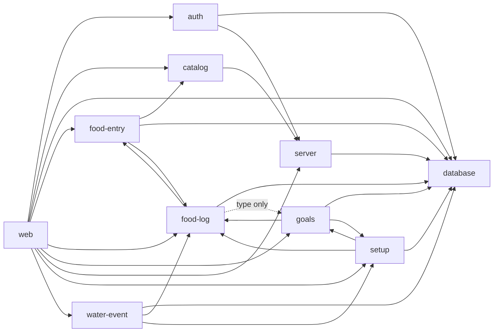

# Architecture contract

Open Calory Tracker is organized by feature. The Fallow configuration in
`.fallowrc.json` is the executable architecture contract: every analyzed source
file belongs to one zone, every cross-zone import must be listed, and sensitive
side effects are limited to their owners. The contract uses custom zones rather
than a framework preset because it describes the application as it exists.

Run `pnpm architecture` after changing imports, adding a production file, or
changing an exported signature. `pnpm lint` runs the same gate.

## Production zones and APIs

Files inside a zone may import one another. Cross-zone callers should use the
API modules named below instead of reaching into implementation details unless
the existing graph explicitly requires that lower-level contract.

| Zone | Responsibility | API and composition modules |
| --- | --- | --- |
| `web` | React Router route handlers, page UI, navigation, icons, and global styles | `app/root.tsx`, `app/routes.ts`, and `app/routes/*` are framework entry points; routes consume feature APIs |
| `auth` | Credentials, sessions, CSRF, rate limiting, password policy, and authentication UI/validation | `runtime.server.ts` composes services; `http.server.ts` exposes request/cookie helpers; `validation.ts` and `password.server.ts` expose input/password contracts |
| `catalog` | Food-catalog contract, USDA adapter, and deterministic test provider | `food-catalog.server.ts` is the provider contract; `runtime.server.ts` selects and returns the provider |
| `database` | SQLite opening, migration, readiness, schema, and process-local database lifecycle | `database.server.ts` exposes database types and status; `runtime.server.ts` owns the singleton lifecycle; `schema.server.ts` is the persistence schema |
| `food-entry` | Creating and editing immutable food snapshots and nutrient scaling | `runtime.server.ts` composes `FoodEntryService`; `food-entry.server.ts`, `snapshot.server.ts`, and `nutrition.ts` expose the feature contracts used by routes and food-log |
| `food-log` | Local-date rules, event ordering, daily log queries, and event timestamps | `runtime.server.ts` composes `FoodLogService`; `food-log.server.ts`, `date.ts`, and `event-time.server.ts` are shared domain APIs |
| `goals` | Versioned nutrition goals, display conversion, and goal validation | `runtime.server.ts` composes `GoalVersionService`; `goal-version.server.ts`, `validation.ts`, and `water-conversion.ts` expose domain APIs |
| `setup` | Initial preferences and goal creation | `runtime.server.ts` composes `GoalSetupService`; `validation.ts` is shared by setup, goals, and water-event |
| `water-event` | Creating, editing, and deleting water events | `runtime.server.ts` composes `WaterEventService`; `water-event.server.ts` exposes its domain contract |
| `server` | HTTP host lifecycle, request metadata, operational logging, and environment parsing | `server.js` is the process entry point; `server/app.ts` is the React Router request-handler entry point; `app/runtime.server.ts` owns application-wide environment parsing |

`tests` and `tooling` are separate non-production zones. Tests may import any
production zone. Tooling is isolated except for the shared Argon2 profile,
which is owned by `auth` even though its runtime file lives under `scripts/`.

Exported functions, classes, and components form a module API. Every named type
that appears in an exported signature is exported too; Fallow enforces this with
`private-type-leaks: error`. There are no barrel APIs, and re-export cycles and
ordinary import cycles are both errors.

## Directed dependency graph

The arrows below are the permitted production imports. An omitted arrow is
forbidden. The `food-log` to `goals` edge is type-only; a runtime import on that
edge fails the gate.

Mutual zone arrows document existing collaboration between features; they do
not permit a module cycle. Fallow independently rejects every circular import
chain.

## Entry points

- `server.js` starts the HTTP process, loads Vite in development or the built
  server bundle in production, and owns graceful shutdown.
- `server/app.ts` initializes the database and exports the Express request
  handler and shutdown hook. It is declared in `dynamicallyLoaded` because the
  host loads it indirectly.
- `app/root.tsx`, `app/routes.ts`, and every module in `app/routes/` are React
  Router entry points discovered by Fallow's React Router plugin.
- Package scripts, Vitest files, Playwright specs, Drizzle schema/configuration,
  and tool configuration are development entry points discovered from their
  package scripts and framework plugins.

## Authorized side effects

| Effect | Authorized owner | Enforcement |
| --- | --- | --- |
| Network (`fetch`) | `catalog`, specifically the USDA adapter; tests/tooling may exercise HTTP | Forbidden-call rules reject it in every other production zone |
| Database | `database` owns connections/migrations; persistence services in `auth`, `food-entry`, `food-log`, `goals`, `setup`, and `water-event` may query through the database contract; `web` may call the readiness/lifecycle API only | Import rules restrict access to the database zone; raw `better-sqlite3` and `drizzle-orm` calls are additionally forbidden in `web`, `catalog`, and `server` |
| Filesystem (`node:fs`) | `database` for production storage/migrations; tests/tooling for fixtures and reports | Forbidden-call rules reject filesystem calls in every other production zone |
| Child processes (`node:child_process`) | Tests and tooling only | Forbidden-call rules reject child-process calls in every production zone |
| `process.exit` | `server.js` during graceful shutdown; tests/tooling may control child processes | Forbidden-call rules reject it in every other production zone |

Fallow call rules check direct calls. Import-zone rules are the complementary
control for effects hidden behind a local API.

## Changing the contract

1. Put a new source file in the zone that owns its responsibility. An unzoned
   file fails boundary coverage.
2. Prefer an existing API module. Add an allowed edge only when the feature
   design genuinely changes, and update this document in the same change.
3. Keep side effects in an authorized owner. Pass capabilities into pure code
   when a test seam is needed.
4. Run `pnpm architecture`; its isolated policy tests prove that a forbidden
   import, a circular dependency, an unzoned file, and unauthorized side-effect
   calls each return exit code 1.
