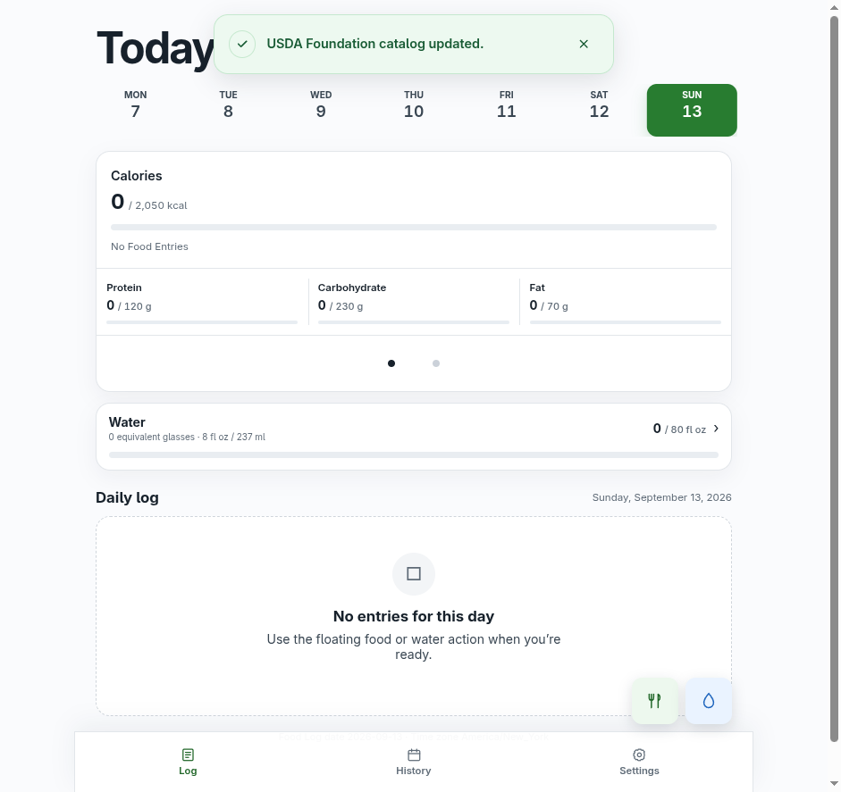
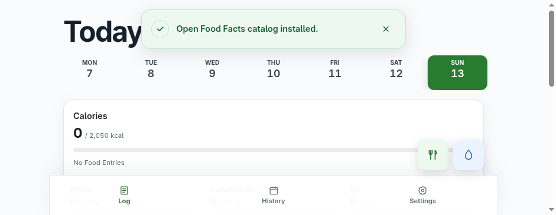

# Command import and notification evidence

Captured on 2026-09-13 using chrome-devtools-axi against an isolated production server. The commands used the live local control API and actual import workers. Toasts came from normal browser polling while the Daily Log remained open.

| Import | Input | Exit code | Browser toast |
| --- | --- | --- | --- |
| USDA install | Official April 2026 Foundation ZIP; 469 foods installed | 0 | USDA Foundation catalog installed. |
| USDA reimport | Same ZIP; 469 foods installed | 0 | USDA Foundation catalog updated. |
| OFF install | One-product TSV/GZIP fixture; one food installed | 0 | Open Food Facts catalog installed. in administrator and member clients |
| OFF reimport | Same fixture; one food installed | 0 | Open Food Facts catalog updated. in both clients |

## Screenshots

## Terminal and refresh checks

- [USDA install output](usda-install-terminal.log)
- [USDA reimport output](usda-update-terminal.log)
- [OFF install output](off-install-terminal.log)
- [OFF reimport output](off-update-terminal.log)
- [Administrator refresh check](catalog-demo-refresh-check.log)
- [Member refresh check](catalog-demo-member-refresh-check.log)

Both refresh checks observed zero catalog toasts after a polling interval. The member notification endpoint returned only provider, job ID, phase, completion time, and operation for successes.

The [first OFF attempt](off-disk-guard-terminal.log) failed before import because `/tmp` had 15 GB available and the production importer reserves 32 GB. Moving isolated catalog storage to the main disk resolved this without changing the guard. OFF used a small fixture rather than the full public dataset; USDA used the official archive.

The production app ran on control port 4373 and LAN browser port 4374 with a fresh SQLite application database and synthetic administrator/member accounts. The test-owned server and Chrome sessions were stopped after capture.
